# [Nombre de la Aplicación]

## 👥 Miembros del Equipo
| Nombre y Apellidos | Correo URJC | Usuario GitHub |
|:--- |:--- |:--- |
| Víctor Muñoz Regalón | v.munozr.2020@alumnos.urjc.es | victoor-78 |

---

## 🎭 **Preparación 1: Definición del Proyecto**

### **Descripción del Tema**
Aplicación web de un restaurante que permite consultar la carta y realizar comandas directamente desde la web. El objetivo es mejorar la eficiencia del servicio, reduciendo tiempos de espera y agilizando la comunicación con cocina. Las comandas enviadas por los clientes llegan de forma inmediata al personal de cocina, permitiendo iniciar la preparación sin depender de la toma de nota por parte del camarero.

### **Entidades**
Indicar las entidades principales que gestionará la aplicación y las relaciones entre ellas:

1. **Entidad 1**: Usuarios
2. **Entidad 2**: Producto
3. **Entidad 3**: Comanda

**Relaciones entre entidades:**
- Usuario - Comanda: Un usuario puede tener múltiples comandas (1:N)
- Comanda - Producto: Una comanda puede contener múltiples productos y un producto puede estar en múltiples comandas (N:M)

### **Permisos de los Usuarios**
Describir los permisos de cada tipo de usuario e indicar de qué entidades es dueño:

* **Usuario Anónimo**: 
  - Permisos: Visualizar la información pública del restaurante, consultar la carta de productos, ver la ubicación y enlaces relevantes (redes sociales), y registrarse/iniciar sesión en la plataforma. 
  - No es dueño de ninguna entidad

* **Usuario Registrado (cliente)**: 
  - Permisos: Gestionar su perfil personal, realizar comandas desde la web y consultar el historial de comandas realizadas (productos, fecha e importe).
  - Es dueño de: Su perfil de usuario y sus propias comandas.

* **Administrador**: 
  - Permisos: Gestión completa de productos (crear, editar, eliminar y habilitar/deshabilitar), visualización y gestión de todas las comandas (incluyendo cambio de estado), y gestión de usuarios registrados (banear y desbanear usuarios.)
  - Es dueño de: Productos y comandas, y puede gestionar todas las entidades del sistema.

### **Imágenes**
Indicar qué entidades tendrán asociadas una o varias imágenes:

- **Entidad con imágenes 1**:  Usuario - Imagen de perfil asociada a cada usuario registrado.
- **Entidad con imágenes 2**: Producto - Una o varias imágenes por producto para mostrar los platos, bebidas y postres disponibles en la carta

### **Gráficos**
Indicar qué información se mostrará usando gráficos y de qué tipo serán:

- **Gráfico 1**: Facturación diaria del restaurante (importe total de las comandas por día) – Gráfico de barras.
- **Gráfico 2**: Número de comandas por franja horaria a lo largo del día – Gráfico de barras.
- **Gráfico 3**: Evolución del número de usuarios registrados – Gráfico de líneas.

### **Tecnología Complementaria**
Indicar qué tecnología complementaria se empleará:

- Generación de un ticket/factura en PDF para cada comanda (descargable por el cliente y/o accesible desde el panel de administración), usando una librería de generación de PDFs (por ejemplo, iText o similar).
- Notificación por correo al administrador con un resumen diario de actividad (número de comandas y facturación), y aviso de productos marcados como no disponibles.

### **Algoritmo o Consulta Avanzada**
Indicar cuál será el algoritmo o consulta avanzada que se implementará:

- **Algoritmo/Consulta**: Consulta avanzada de facturación y número de comandas agrupadas por fecha y franja horaria.
- **Descripción**: A partir de la fecha/hora de creación y el importe total de cada comanda, la consulta agrupa la información por día y por hora (o franja horaria) para calcular el número de comandas y la facturación total en cada grupo. Esto permite generar gráficos de actividad, detectar picos de trabajo y analizar la evolución del restaurante.
- **Alternativa**: Consulta avanzada de evolución de usuarios registrados, agrupando altas por día/mes para analizar el crecimiento de la plataforma y generar un gráfico temporal.

---

## 🛠 **Preparación 2: Maquetación de páginas con HTML y CSS**

### **Vídeo de Demostración**
📹 **[Enlace al vídeo en YouTube](https://www.youtube.com/watch?v=x91MPoITQ3I)**
> Vídeo mostrando las principales funcionalidades de la aplicación web.

### **Diagrama de Navegación**
Diagrama que muestra cómo se navega entre las diferentes páginas de la aplicación:


> [Descripción opcional del flujo de navegación: Ej: "El usuario puede acceder desde la página principal a todas las secciones mediante el menú de navegación. Los usuarios anónimos solo tienen acceso a las páginas públicas, mientras que los registrados pueden acceder a su perfil y panel de usuario."]

### **Capturas de Pantalla y Descripción de Páginas**

#### **1. Página Principal / Inicio**
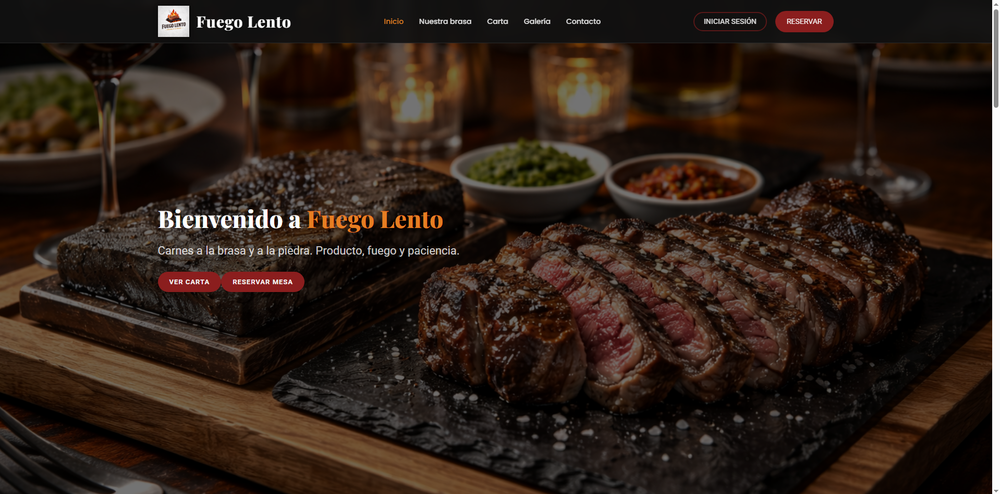

> Página principal de la aplicación que actúa como punto de entrada para todos los usuarios. Incluye una barra de navegación superior con acceso a las secciones informativas del restaurante: Inicio, Nuestra brasa, Carta, Galería, Contacto y Reservar. Desde esta pantalla los usuarios no autenticados pueden consultar información general y acceder al inicio de sesión o registro.


#### **2. Página Nuestra Brasa**
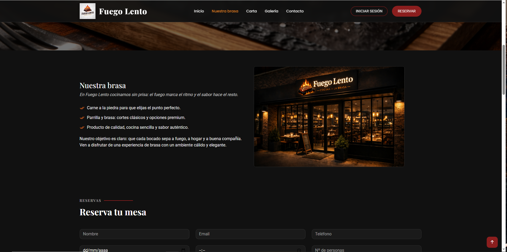

> Sección de la página principal que presenta la filosofía del restaurante, el tipo de cocina y el proceso de elaboración de los platos. Su objetivo es transmitir la identidad del negocio y reforzar la experiencia del usuario antes de realizar una reserva o pedido.


#### **3. Página de Reservas**
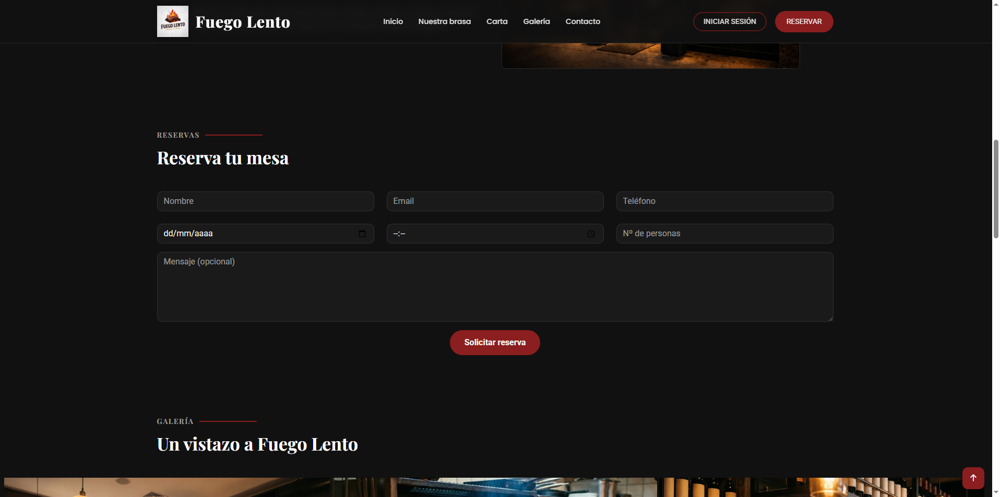

> Sección accesible desde la página principal que permite al usuario realizar una reserva de mesa en el restaurante mediante un formulario. En esta entrega, la funcionalidad se presenta de forma simulada a la espera de la implementación del backend.


#### **4. Página de Galería**


> Sección de la página principal que muestra una galería de imágenes representativas del restaurante, los platos y el ambiente. Su finalidad es reforzar la imagen del negocio y ofrecer una vista previa de la experiencia gastronómica.


#### **5. Página de Contacto**
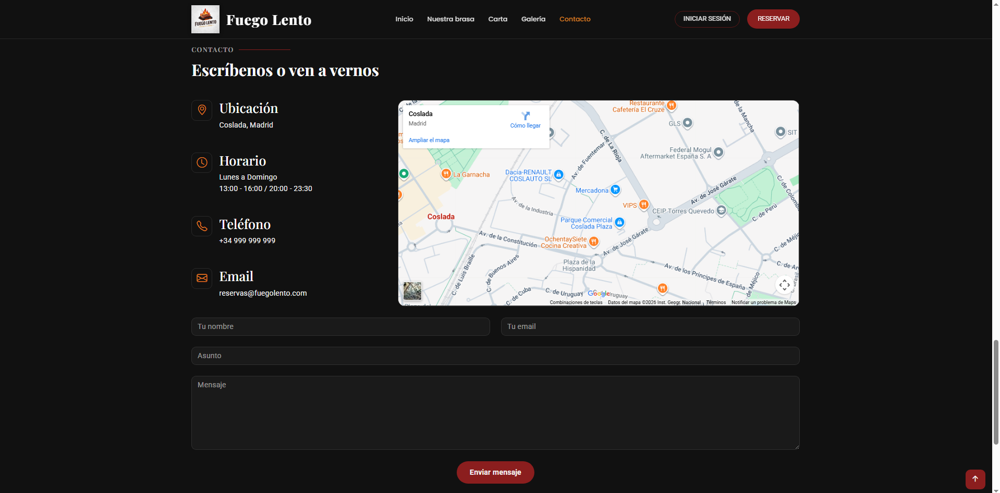

> Sección informativa de la página principal que proporciona los datos de contacto del restaurante, como la ubicación y los medios de comunicación disponibles. Permite al usuario obtener información adicional o realizar consultas.


#### **6. Página de Carta**
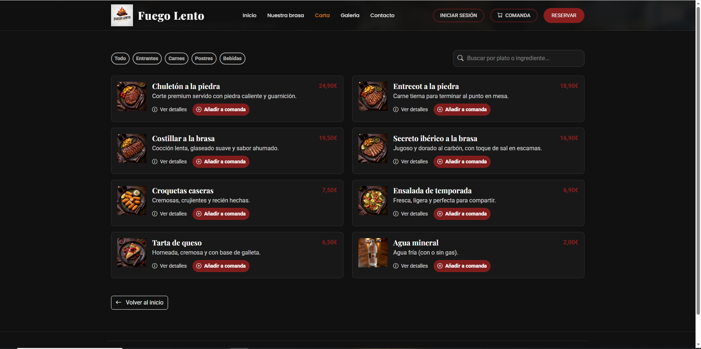

> Pantalla que muestra la carta completa del restaurante, organizada por categorías. Desde esta página, los usuarios registrados pueden acceder al detalle de los platos y añadir productos a la comanda, mientras que los usuarios no registrados pueden visualizar la información.


#### **7. Página de Detalle de Plato**
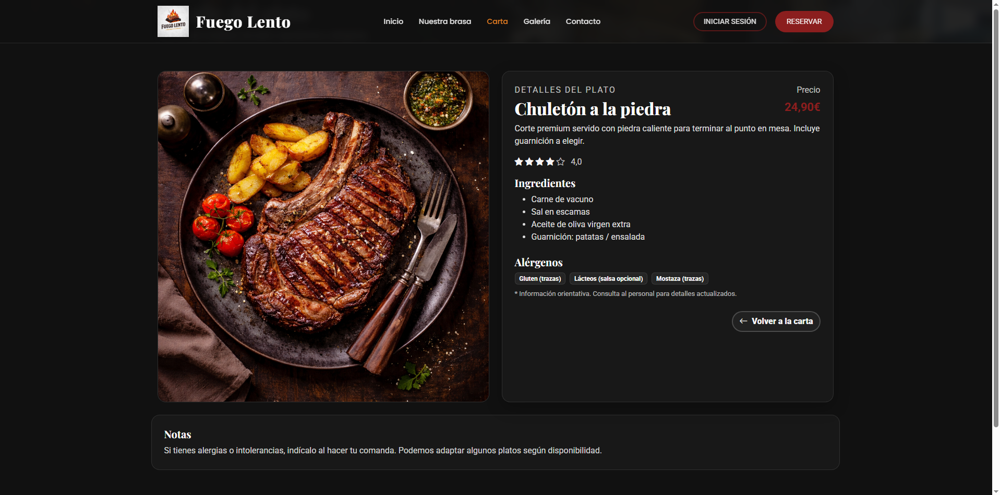

> Pantalla que muestra la información detallada de un plato concreto, incluyendo imagen, descripción y precio. Desde esta vista, los usuarios registrados pueden añadir el producto a la comanda activa.


#### **8. Página de Iniciar Sesión / Registro**
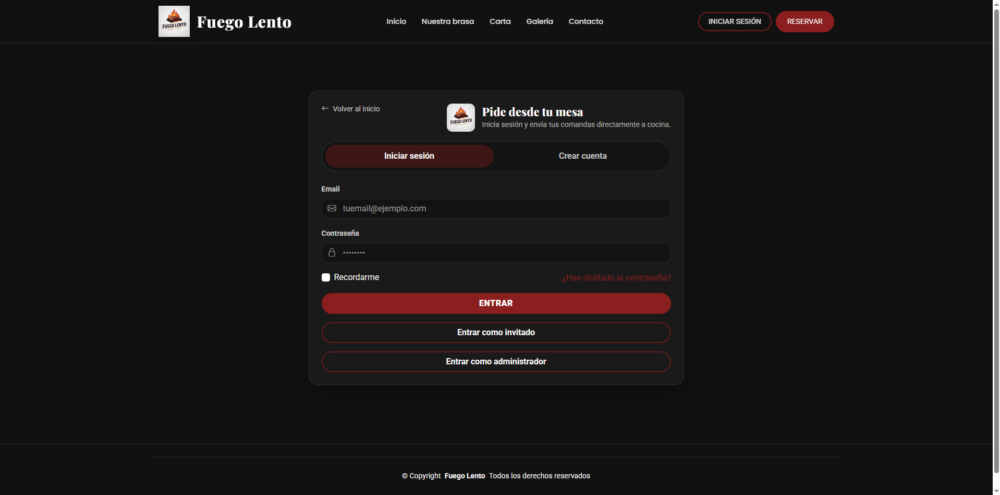

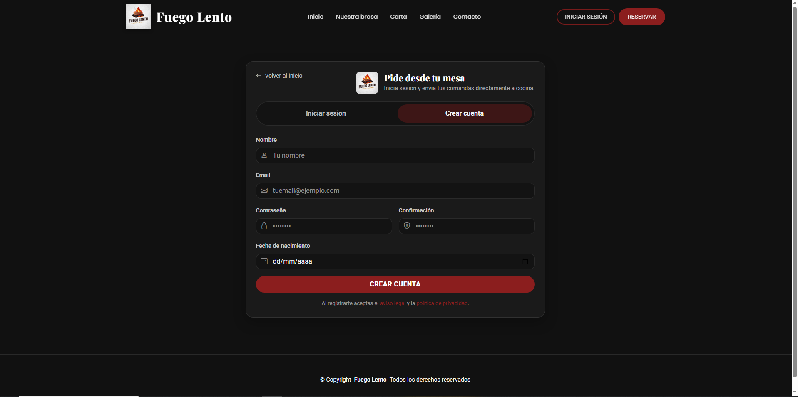

> Pantalla de autenticación que permite a los usuarios iniciar sesión o registrarse en la aplicación. En esta entrega, la autenticación está simulada y permite acceder tanto al perfil de usuario como al modo administrador para mostrar las vistas según el rol.


#### **9. Página de Comanda**
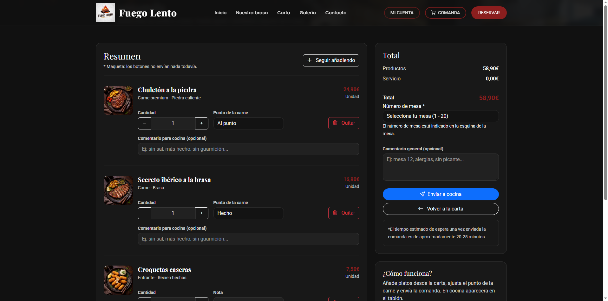

> Pantalla donde el usuario puede visualizar los productos añadidos a su comanda, modificar cantidades o eliminar elementos antes de confirmar el pedido. Representa el paso previo al envío de la comanda a cocina.


#### **10. Página de Confirmación de Comanda Enviada**
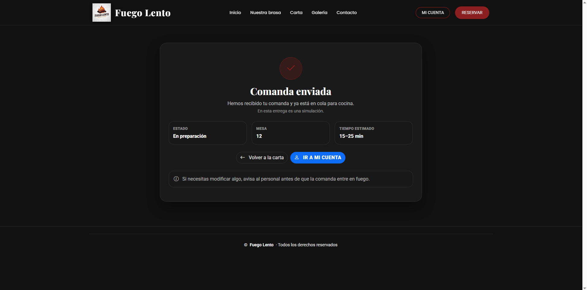

> Pantalla de confirmación que se muestra una vez el usuario ha enviado correctamente la comanda. Informa de que el pedido ha sido registrado correctamente y muestra un mensaje de confirmación al usuario.


#### **11. Perfil de Usuario**
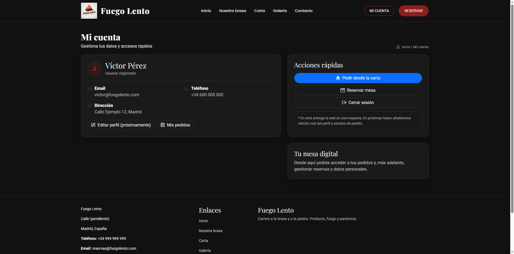

> Pantalla accesible para usuarios autenticados que muestra la información básica del perfil. Desde esta vista, el usuario puede consultar sus datos y acceder a funcionalidades relacionadas con su cuenta, como la visualización del historial de pedidos.


#### **12. Historial de Pedidos**
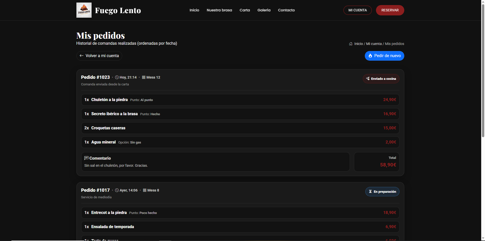

> Pantalla que permite al usuario consultar el historial de pedidos realizados en el restaurante. Muestra una lista de comandas ordenadas cronológicamente, facilitando el seguimiento de pedidos anteriores y su estado.


#### **13. Comandas Cocina**
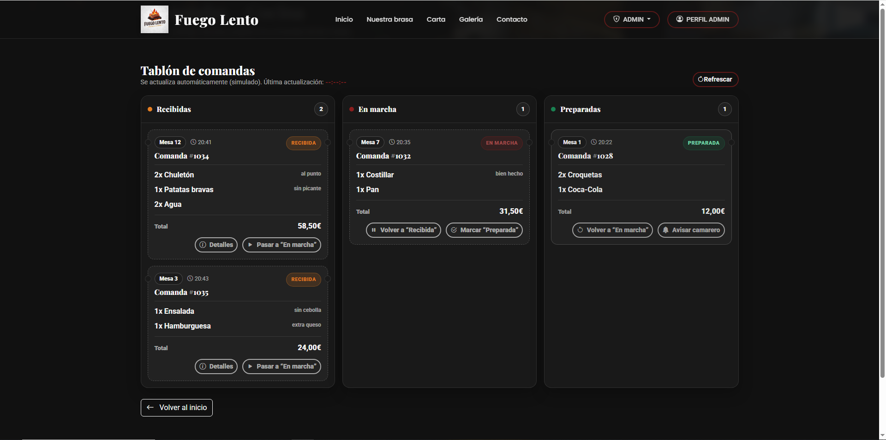

> Pantalla destinada al personal de cocina que muestra un tablón de comandas organizado por estados (recibidas, en marcha y preparadas). Permite visualizar en tiempo real las comandas activas y facilita la gestión del flujo de trabajo en cocina.


#### **14. Administrar Comandas**
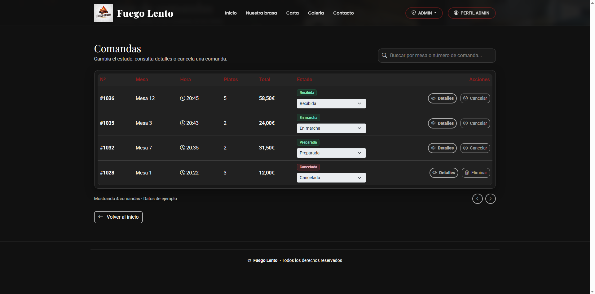

> Pantalla de administración que permite al usuario con rol administrador consultar y gestionar las comandas realizadas. Desde esta vista se pueden revisar los detalles de cada comanda, cambiar su estado o cancelarlas.


#### **15. Administrar Usuarios**
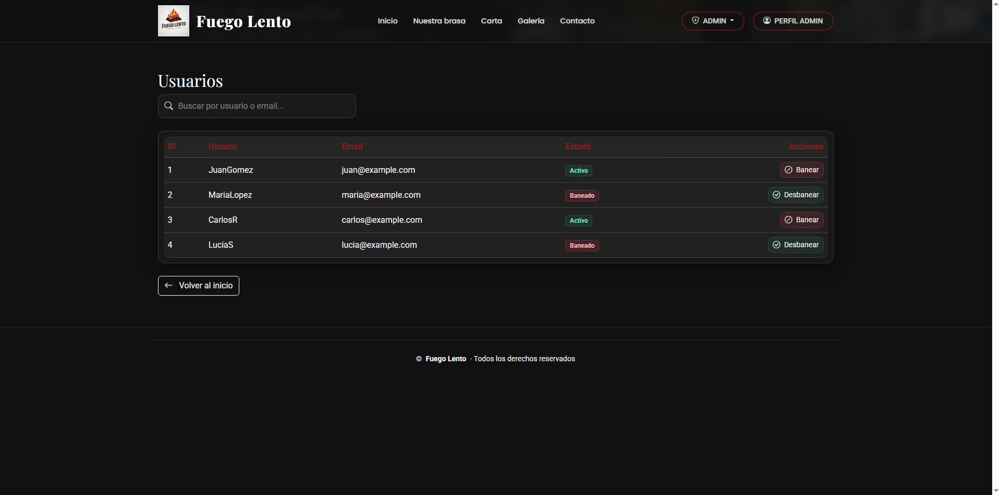

> Pantalla de administración que permite gestionar los usuarios registrados en la aplicación. Desde esta vista, el administrador puede visualizar el listado de usuarios y modificar su estado, como bloquear o reactivar cuentas.


#### **16. Administrar Productos**
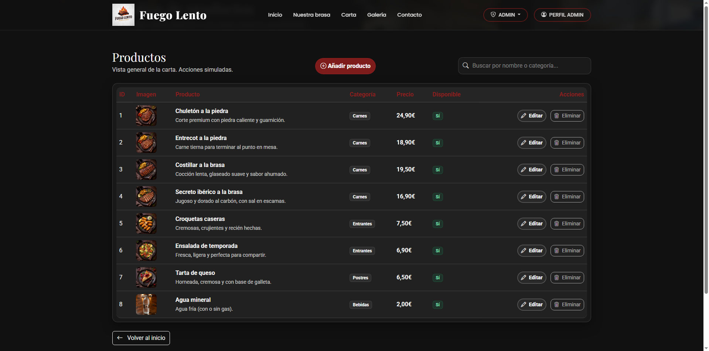

> Pantalla de administración que muestra el listado completo de productos disponibles en la carta. Permite al administrador acceder a las opciones de creación, edición y eliminación de productos.


#### **17. Editar Producto**
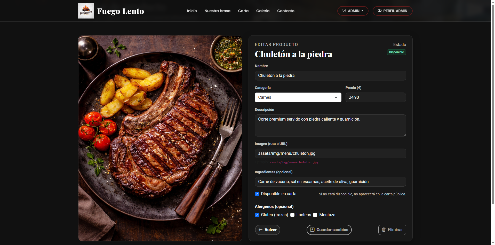

> Pantalla que permite al administrador modificar la información de un producto existente, como nombre, categoría, precio, descripción, imagen y disponibilidad. Desde esta vista se pueden actualizar los datos del producto seleccionado.


#### **18. Añadir Producto**
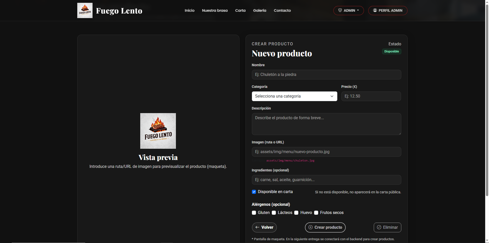

> Pantalla que permite al administrador crear un nuevo producto para la carta del restaurante. Incluye un formulario para introducir los datos necesarios del producto.


## 🛠 **Práctica 1: Web con HTML generado en servidor y AJAX**

### **Vídeo de Demostración**
📹 **[Enlace al vídeo en YouTube](https://www.youtube.com/watch?v=x91MPoITQ3I)**
> Vídeo mostrando las principales funcionalidades de la aplicación web.

### **Navegación y Capturas de Pantalla**

#### **Diagrama de Navegación**

Solo si ha cambiado.

#### **Capturas de Pantalla Actualizadas**

Solo si han cambiado.

### **Instrucciones de Ejecución**

#### **Requisitos Previos**
- **Java**: versión 21 o superior
- **Maven**: versión 3.8 o superior
- **MySQL**: versión 8.0 o superior
- **Git**: para clonar el repositorio

#### **Pasos para ejecutar la aplicación**

1. **Clonar el repositorio**
   ```bash
   git clone https://github.com/[usuario]/[nombre-repositorio].git
   cd [nombre-repositorio]
   ```

2. **AQUÍ INDICAR LO SIGUIENTES PASOS**

#### **Credenciales de prueba**
- **Usuario Admin**: usuario: `admin`, contraseña: `admin`
- **Usuario Registrado**: usuario: `user`, contraseña: `user`

### **Diagrama de Entidades de Base de Datos**

Diagrama mostrando las entidades, sus campos y relaciones:


> [Descripción opcional: Ej: "El diagrama muestra las 4 entidades principales: Usuario, Producto, Pedido y Categoría, con sus respectivos atributos y relaciones 1:N y N:M."]

### **Diagrama de Clases y Templates**

Diagrama de clases de la aplicación con diferenciación por colores o secciones:


> [Descripción opcional del diagrama y relaciones principales]

### **Participación de Miembros en la Práctica 1**

#### **Alumno 1 - [Nombre Completo]**

[Descripción de las tareas y responsabilidades principales del alumno en el proyecto]

| Nº    | Commits      | Files      |
|:------------: |:------------:| :------------:|
|1| [Descripción commit 1](URL_commit_1)  | [Archivo1](URL_archivo_1)   |
|2| [Descripción commit 2](URL_commit_2)  | [Archivo2](URL_archivo_2)   |
|3| [Descripción commit 3](URL_commit_3)  | [Archivo3](URL_archivo_3)   |
|4| [Descripción commit 4](URL_commit_4)  | [Archivo4](URL_archivo_4)   |
|5| [Descripción commit 5](URL_commit_5)  | [Archivo5](URL_archivo_5)   |

---

#### **Alumno 2 - [Nombre Completo]**

[Descripción de las tareas y responsabilidades principales del alumno en el proyecto]

| Nº    | Commits      | Files      |
|:------------: |:------------:| :------------:|
|1| [Descripción commit 1](URL_commit_1)  | [Archivo1](URL_archivo_1)   |
|2| [Descripción commit 2](URL_commit_2)  | [Archivo2](URL_archivo_2)   |
|3| [Descripción commit 3](URL_commit_3)  | [Archivo3](URL_archivo_3)   |
|4| [Descripción commit 4](URL_commit_4)  | [Archivo4](URL_archivo_4)   |
|5| [Descripción commit 5](URL_commit_5)  | [Archivo5](URL_archivo_5)   |

---

#### **Alumno 3 - [Nombre Completo]**

[Descripción de las tareas y responsabilidades principales del alumno en el proyecto]

| Nº    | Commits      | Files      |
|:------------: |:------------:| :------------:|
|1| [Descripción commit 1](URL_commit_1)  | [Archivo1](URL_archivo_1)   |
|2| [Descripción commit 2](URL_commit_2)  | [Archivo2](URL_archivo_2)   |
|3| [Descripción commit 3](URL_commit_3)  | [Archivo3](URL_archivo_3)   |
|4| [Descripción commit 4](URL_commit_4)  | [Archivo4](URL_archivo_4)   |
|5| [Descripción commit 5](URL_commit_5)  | [Archivo5](URL_archivo_5)   |

---

#### **Alumno 4 - [Nombre Completo]**

[Descripción de las tareas y responsabilidades principales del alumno en el proyecto]

| Nº    | Commits      | Files      |
|:------------: |:------------:| :------------:|
|1| [Descripción commit 1](URL_commit_1)  | [Archivo1](URL_archivo_1)   |
|2| [Descripción commit 2](URL_commit_2)  | [Archivo2](URL_archivo_2)   |
|3| [Descripción commit 3](URL_commit_3)  | [Archivo3](URL_archivo_3)   |
|4| [Descripción commit 4](URL_commit_4)  | [Archivo4](URL_archivo_4)   |
|5| [Descripción commit 5](URL_commit_5)  | [Archivo5](URL_archivo_5)   |

---

## 🛠 **Práctica 2: Incorporación de una API REST a la aplicación web, despliegue con Docker y despliegue remoto**

### **Vídeo de Demostración**
📹 **[Enlace al vídeo en YouTube](https://www.youtube.com/watch?v=x91MPoITQ3I)**
> Vídeo mostrando las principales funcionalidades de la aplicación web.

### **Documentación de la API REST**

#### **Especificación OpenAPI**
📄 **[Especificación OpenAPI (YAML)](/api-docs/api-docs.yaml)**

#### **Documentación HTML**
📖 **[Documentación API REST (HTML)](https://raw.githack.com/[usuario]/[repositorio]/main/api-docs/api-docs.html)**

> La documentación de la API REST se encuentra en la carpeta `/api-docs` del repositorio. Se ha generado automáticamente con SpringDoc a partir de las anotaciones en el código Java.

### **Diagrama de Clases y Templates Actualizado**

Diagrama actualizado incluyendo los @RestController y su relación con los @Service compartidos:


### **Instrucciones de Ejecución con Docker**

#### **Requisitos previos:**
- Docker instalado (versión 20.10 o superior)
- Docker Compose instalado (versión 2.0 o superior)

#### **Pasos para ejecutar con docker-compose:**

1. **Clonar el repositorio** (si no lo has hecho ya):
   ```bash
   git clone https://github.com/[usuario]/[repositorio].git
   cd [repositorio]
   ```

2. **AQUÍ LOS SIGUIENTES PASOS**:

### **Construcción de la Imagen Docker**

#### **Requisitos:**
- Docker instalado en el sistema

#### **Pasos para construir y publicar la imagen:**

1. **Navegar al directorio de Docker**:
   ```bash
   cd docker
   ```

2. **AQUÍ LOS SIGUIENTES PASOS**

### **Despliegue en Máquina Virtual**

#### **Requisitos:**
- Acceso a la máquina virtual (SSH)
- Clave privada para autenticación
- Conexión a la red correspondiente o VPN configurada

#### **Pasos para desplegar:**

1. **Conectar a la máquina virtual**:
   ```bash
   ssh -i [ruta/a/clave.key] [usuario]@[IP-o-dominio-VM]
   ```
   
   Ejemplo:
   ```bash
   ssh -i ssh-keys/app.key vmuser@10.100.139.XXX
   ```

2. **AQUÍ LOS SIGUIENTES PASOS**:

### **URL de la Aplicación Desplegada**

🌐 **URL de acceso**: `https://[nombre-app].etsii.urjc.es:8443`

#### **Credenciales de Usuarios de Ejemplo**

| Rol | Usuario | Contraseña |
|:---|:---|:---|
| Administrador | admin | admin123 |
| Usuario Registrado | user1 | user123 |
| Usuario Registrado | user2 | user123 |

### **Participación de Miembros en la Práctica 2**

#### **Alumno 1 - [Nombre Completo]**

[Descripción de las tareas y responsabilidades principales del alumno en el proyecto]

| Nº    | Commits      | Files      |
|:------------: |:------------:| :------------:|
|1| [Descripción commit 1](URL_commit_1)  | [Archivo1](URL_archivo_1)   |
|2| [Descripción commit 2](URL_commit_2)  | [Archivo2](URL_archivo_2)   |
|3| [Descripción commit 3](URL_commit_3)  | [Archivo3](URL_archivo_3)   |
|4| [Descripción commit 4](URL_commit_4)  | [Archivo4](URL_archivo_4)   |
|5| [Descripción commit 5](URL_commit_5)  | [Archivo5](URL_archivo_5)   |

---

#### **Alumno 2 - [Nombre Completo]**

[Descripción de las tareas y responsabilidades principales del alumno en el proyecto]

| Nº    | Commits      | Files      |
|:------------: |:------------:| :------------:|
|1| [Descripción commit 1](URL_commit_1)  | [Archivo1](URL_archivo_1)   |
|2| [Descripción commit 2](URL_commit_2)  | [Archivo2](URL_archivo_2)   |
|3| [Descripción commit 3](URL_commit_3)  | [Archivo3](URL_archivo_3)   |
|4| [Descripción commit 4](URL_commit_4)  | [Archivo4](URL_archivo_4)   |
|5| [Descripción commit 5](URL_commit_5)  | [Archivo5](URL_archivo_5)   |

---

#### **Alumno 3 - [Nombre Completo]**

[Descripción de las tareas y responsabilidades principales del alumno en el proyecto]

| Nº    | Commits      | Files      |
|:------------: |:------------:| :------------:|
|1| [Descripción commit 1](URL_commit_1)  | [Archivo1](URL_archivo_1)   |
|2| [Descripción commit 2](URL_commit_2)  | [Archivo2](URL_archivo_2)   |
|3| [Descripción commit 3](URL_commit_3)  | [Archivo3](URL_archivo_3)   |
|4| [Descripción commit 4](URL_commit_4)  | [Archivo4](URL_archivo_4)   |
|5| [Descripción commit 5](URL_commit_5)  | [Archivo5](URL_archivo_5)   |

---

#### **Alumno 4 - [Nombre Completo]**

[Descripción de las tareas y responsabilidades principales del alumno en el proyecto]

| Nº    | Commits      | Files      |
|:------------: |:------------:| :------------:|
|1| [Descripción commit 1](URL_commit_1)  | [Archivo1](URL_archivo_1)   |
|2| [Descripción commit 2](URL_commit_2)  | [Archivo2](URL_archivo_2)   |
|3| [Descripción commit 3](URL_commit_3)  | [Archivo3](URL_archivo_3)   |
|4| [Descripción commit 4](URL_commit_4)  | [Archivo4](URL_archivo_4)   |
|5| [Descripción commit 5](URL_commit_5)  | [Archivo5](URL_archivo_5)   |

---

## 🛠 **Práctica 3: Implementación de la web con arquitectura SPA**

### **Vídeo de Demostración**
📹 **[Enlace al vídeo en YouTube](URL_del_video)**
> Vídeo mostrando las principales funcionalidades de la aplicación web.

### **Preparación del Entorno de Desarrollo**

#### **Requisitos Previos**
- **Node.js**: versión 18.x o superior
- **npm**: versión 9.x o superior (se instala con Node.js)
- **Git**: para clonar el repositorio

#### **Pasos para configurar el entorno de desarrollo**

1. **Instalar Node.js y npm**
   
   Descarga e instala Node.js desde [https://nodejs.org/](https://nodejs.org/)
   
   Verifica la instalación:
   ```bash
   node --version
   npm --version
   ```

2. **Clonar el repositorio** (si no lo has hecho ya)
   ```bash
   git clone https://github.com/[usuario]/[nombre-repositorio].git
   cd [nombre-repositorio]
   ```

3. **Navegar a la carpeta del proyecto React**
   ```bash
   cd frontend
   ```

4. **AQUÍ LOS SIGUIENTES PASOS**

### **Diagrama de Clases y Templates de la SPA**

Diagrama mostrando los componentes React, hooks personalizados, servicios y sus relaciones:


### **Participación de Miembros en la Práctica 3**

#### **Alumno 1 - [Nombre Completo]**

[Descripción de las tareas y responsabilidades principales del alumno en el proyecto]

| Nº    | Commits      | Files      |
|:------------: |:------------:| :------------:|
|1| [Descripción commit 1](URL_commit_1)  | [Archivo1](URL_archivo_1)   |
|2| [Descripción commit 2](URL_commit_2)  | [Archivo2](URL_archivo_2)   |
|3| [Descripción commit 3](URL_commit_3)  | [Archivo3](URL_archivo_3)   |
|4| [Descripción commit 4](URL_commit_4)  | [Archivo4](URL_archivo_4)   |
|5| [Descripción commit 5](URL_commit_5)  | [Archivo5](URL_archivo_5)   |

---

#### **Alumno 2 - [Nombre Completo]**

[Descripción de las tareas y responsabilidades principales del alumno en el proyecto]

| Nº    | Commits      | Files      |
|:------------: |:------------:| :------------:|
|1| [Descripción commit 1](URL_commit_1)  | [Archivo1](URL_archivo_1)   |
|2| [Descripción commit 2](URL_commit_2)  | [Archivo2](URL_archivo_2)   |
|3| [Descripción commit 3](URL_commit_3)  | [Archivo3](URL_archivo_3)   |
|4| [Descripción commit 4](URL_commit_4)  | [Archivo4](URL_archivo_4)   |
|5| [Descripción commit 5](URL_commit_5)  | [Archivo5](URL_archivo_5)   |

---

#### **Alumno 3 - [Nombre Completo]**

[Descripción de las tareas y responsabilidades principales del alumno en el proyecto]

| Nº    | Commits      | Files      |
|:------------: |:------------:| :------------:|
|1| [Descripción commit 1](URL_commit_1)  | [Archivo1](URL_archivo_1)   |
|2| [Descripción commit 2](URL_commit_2)  | [Archivo2](URL_archivo_2)   |
|3| [Descripción commit 3](URL_commit_3)  | [Archivo3](URL_archivo_3)   |
|4| [Descripción commit 4](URL_commit_4)  | [Archivo4](URL_archivo_4)   |
|5| [Descripción commit 5](URL_commit_5)  | [Archivo5](URL_archivo_5)   |

---

#### **Alumno 4 - [Nombre Completo]**

[Descripción de las tareas y responsabilidades principales del alumno en el proyecto]

| Nº    | Commits      | Files      |
|:------------: |:------------:| :------------:|
|1| [Descripción commit 1](URL_commit_1)  | [Archivo1](URL_archivo_1)   |
|2| [Descripción commit 2](URL_commit_2)  | [Archivo2](URL_archivo_2)   |
|3| [Descripción commit 3](URL_commit_3)  | [Archivo3](URL_archivo_3)   |
|4| [Descripción commit 4](URL_commit_4)  | [Archivo4](URL_archivo_4)   |
|5| [Descripción commit 5](URL_commit_5)  | [Archivo5](URL_archivo_5)   |

